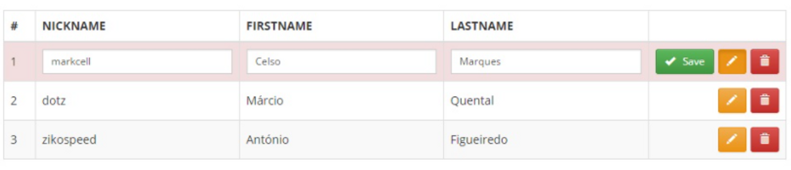

Week1

В течение всего блока React мы будем создавать приложение для изучения иностранных слов по карточкам.
Пример похожего сервиса: [https://www.studystack.com/Languages](https://www.studystack.com/Languages)

У нас будет список слов, а также режим тренировки. Со временем наше приложение обрастет функциональностью.
На этой неделе нужно создать новый проект и набросать структуру приложения (список компонент - jsx файлы).

Что должно быть в результате (через 8 недель):

- Список всех существующих слов. У каждого слова есть основное значение, транскрипция, перевод, тема. У каждого слова должна быть возможность его удаления и редактирования. Также должна быть возможность добавления слов.
- Карточка слова, у которой есть основное значение, транскрипция, перевод, тема.
- Главная страница, где отображаются списки слов и карточек.

Week2

2.  **Задание для проекта:**
    На прошлой неделе мы создали основные элементы интерфейса (хедер, футер, карточку слова, список слов и пр.), на этой неделе вам предстоит их стилизовать.
    Пока что вы можете задавать слова вручную. Чуть позже мы переключим это на API. Структуру для строения слова можете взять отсюда:

        [http://itgirlschool.justmakeit.ru/api/words](http://itgirlschool.justmakeit.ru/api/words)

        - Подключите стили для всех созданных элементов
        - Выделите основные цвета, шрифты и размеры в отдельный файл
        - Добавьте анимацию наведения, фокуса и нажатия на все элементы взаимодействия с пользователем (кнопки, формы и т.д.)
        - Сделайте список слов в виде таблицы. Реализуйте условный рендеринг для полей таблицы: должны отображаться либо поля для чтения и с кнопками редактировать/удалить, либо поля ввода с кнопками сохранить/отмена. Похожий пример:
        

Week 3

2. **Задание для проекта:**

   - Карточке слова добавьте состояние, которое будет отвечать за показывание/скрытие перевода. По умолчанию перевод всегда скрыт. При нажатии на кнопку "Показать перевод", появляется перевод слова, а кнопка исчезает. Реализуйте этот функционал с помощью внутреннего состояния элемента и условного рендеринга.

   - В таблицах добавьте состояние для открытия/закрытия режима редактирования.
   - У всех редактируемых полей изначальное состояние должно получаться из `props`. Добавьте обработчики событий изменения этих полей.
   - Добавьте обработчик события кнопки "отмена редактирования". При нажатии этой кнопки, редактирование закрывается, все поля должны быть возвращены к изначальному значению.

Week 4

2. **Задание для проекта:**

У вас в проекте уже есть компонент, который умеет показывать одну карточку слова, при клике на которую видно перевод.

Создайте новый компонент, который будет получать через props массив слов и показывать их по одному как раз с помощью компонента-карточки.
Также добавьте две кнопки-стрелки, по клику на которые карточка будет меняться на следующую или предыдущую.

**Детали задания:**

- Родительскому компоненту для карточек слов нужно добавить состояние, в котором будет храниться индекс карточки.
  У любого состояния есть начальное значение. Напишите код таким образом, чтобы его можно было взять из prop. А если prop не передан, то показывайте первую карточку из массива.
- Далее нужно добавить методы для перелистывания карточек вперед-назад. Повесить на кнопки соответствующие обработчики событий.
- Нужно продумать момент: что произойдет, когда карточки закончились? Например, можно снова показать первую карточку или вывести сообщение для пользователя.
- В дальнейшем слова будут браться при запросе на сервер. Продумайте момент, как будет вести себя ваше приложение, если массив не передали. Возможно, вам пригодятся свойства по умолчанию (defaultProps).
- Стилизуйте новый компонент. Не забывайте об эффектах для наведения, фокуса и клика
